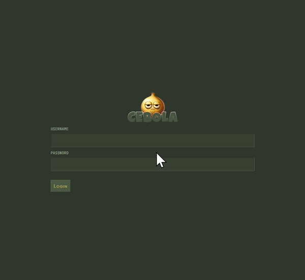

# 📙 Introduction

Welcome to the **Cebola - Self Custody Password Manager**, an open-source project designed to provide a different way to manage your passwords. This project emphasizes user control, security, and simplicity. Host your server and client anywhere you want that you find suitable, and do your own adjustments that better suits your needs. I'll leave you with this boilerplate and I intend to improve it over time, with your help.



# 🔐 Cryptography

Security is at the core of Cebola. To ensure the highest level of protection, we use a symmetric-key encryption with the [Advanced Encryption Standard (AES)](https://en.wikipedia.org/wiki/Advanced_Encryption_Standard) using [GCM](https://en.wikipedia.org/wiki/Galois/Counter_Mode) algorithm with a 256-bit key-length for encrypting password fields. The encrypted passwords are then encoded in Base64 for storage. This approach ensures that your passwords remain secure and are only accessible by you. The encryption and decryption is processed on the client-side which means that, only the client has ever access to the plaintext. All the intended encrypted data moves across the wire always in an encrypted state. Even though we could handle the encryption/decryption on the server, I though that it would be safer and more private to do it fully on the client-side. On top of this, we could (and should) always communicate (client <-> server) in a tls secure connection (https) which translates in another layer of safety (though, how wouldn't we use _https_ these days? - it's like, not even optional).

#### Some aspects

- AES 256-bit encryption: Provides robust security for password data.
- Base64 Encoding: Facilitates safe storage and transmission of encrypted passwords.
- The pattern/formula used for the private key, in plaintext is username+password.

  ```
  john+12345
  ```

  This plaintext seen above, will then be used to derive a key that will then be used both to _lock_ (encrypt) and _unlock_ (decrypt) your passwords.

# 📀 Database

The database for this project is designed using JSON files, structured as a [doubly linked list](https://en.wikipedia.org/wiki/Doubly_linked_list) to enable easy pagination both forwards and backwards. This structure provides a lightweight and flexible way to store and manage password entries without the overhead of a traditional database system.

A database, in your file system, should look something like this:

    /database
    |
    └─ /entries
        └─ entry1.json
        └─ entry2.json
        └─ entry3.json

For every operation that alters the state of the files (create, update, delete) and their relations, creates a temporary backup file with `.bak` extension which is then deleted right after the operation succeeds.

#### Some aspects

- JSON-based Storage: Simple and human-readable format.
- Doubly Linked List: Allows efficient navigation through password entries.
- Self-Contained: No need for an external database server.

# 🧅 Client (Frontend)

The client-side is designed to be intuitive and user-friendly, ensuring that managing your passwords is a seamless experience. The frontend is built using modern web technologies to provide a responsive and accessible interface.

#### Some aspects

- Built in React.js
- User-Friendly Interface: Easy to navigate and manage your passwords.
- Responsive Design: Accessible on various devices, including desktops, tablets, and smartphones.
- Secure Interaction: Ensures that data transmitted between the client and server is encrypted and secure.
- User can add, update and delete entries.
- User can download a full backup of the database in a `.zip` compressed file.
- User can authenticate.

#### Folder structure (`./client`)

The client folder contains all the files related to the frontend of our application. It is built using React, a powerful JavaScript library for building user interfaces.

- `src/components` UI components that form the building blocks of the application.

- `src/contexts` State management for some data that should be available across the app.

- `src/models` APIs for handling the HTTP requests, cryptography utilities, and anything else that might relate to the core functionality of the frontend.

# 🌩️ Server (Backend)

The backend server is responsible for handling the core functionalities of the password manager, including the management of the database - file management in the system.

#### Some aspects

- Node.js: The server is built on Node.js, providing a fast and efficient runtime.
- Express: Uses Express to handle HTTP requests, making the server lightweight and robust.
- Secure API: Provides endpoints for CRUD operations on entries.
- Efficient Data Handling: Uses the doubly linked list structure to manage pagination and storage efficiently.
- Backup: User can download the entire database in a `.zip` file.

#### Folder structure (`./server`)

The server folder holds the backend logic of our application. It is built with Node.js and is responsible for handling the API and interactions with the database.

- `/utils` Utility functions we might need, such as zip compression, file copying, etc.
- `/database` Shouldn't be modified by the developer. The database will contain `/entries` folder within it, where the entries are stored. Each entry is a node, and it's stored in its `.json` file. The name of that file is a random generated id. _example_: `a4t0simhzptbr1v1fgz9cwee.json`
- `api.ts` API endpoints (ie.: POST `/entries`)
- `CebolaServer.ts` Has all the logic associated with the CRUD operations and file (.json files) management.
- `config.ts` Global configurations regarding your own authentication, system paths, and such.

# 💻 Installation and Setup

To get started with the Cebola - Self Custody Password Manager on your localhost...

_Start the backend_

1. Open a terminal on `./server`.
1. `npm install` _dependencies are installed_
1. `npm start` _server starts at port 9000 (default)_
1. `npm test` (optional) _executes all test suits available within directory._

---

_Start the frontend_

1. Open a terminal on `./client`.
1. `npm install` _dependencies are installed_
1. `npm start` _server starts at port 3000 (default)_
1. `npm test` (optional) _executes all test suits available within directory._

# 🚀 Contribution

I welcome contributions from the community! If you have any ideas, suggestions, or bug reports, please open an issue or submit a pull request.

# ☎️ Contact

For any questions or if you simply want to connect, find me at [LinkedIn](https://www.linkedin.com/in/joaogeraldes89/)

Thank you for reading the Cebola - Self Custody Password Manager documentation!
